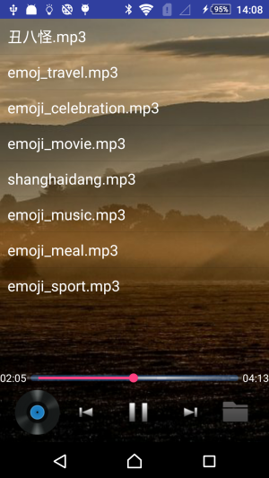
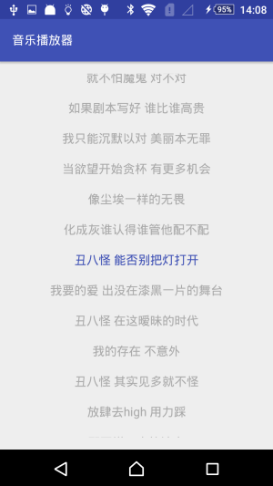
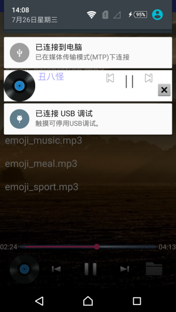

# MusicPlayer
[TOC]

# 前言

本APP为一简单的音乐播放器.暑假实习,闲来无事,正好为了熟悉一些知识点,故开发了这个小程序.

其中歌词滚动参照网上开源的lrcview,其他有些技术也是学习了好多博客上的,十分感谢他们.

**实现的功能:**

1. 自动显示音乐列表
2. 点击列表播放音乐
3. 暂停音乐
4. 上一首音乐
5. 下一首音乐
6. 自动播放下一首歌曲
7. 检索本地音乐
8. 通知栏显示播放状态(实现切歌)
9. 歌词显示（实现歌词滚动功能）

**需要的技术:**

1. MediaPlayer
2. Service
3. Notification
4. Broadcast Receiver
5. 文件操作
6. 等等....

# 界面展示

主界面

歌词界面

通知栏

